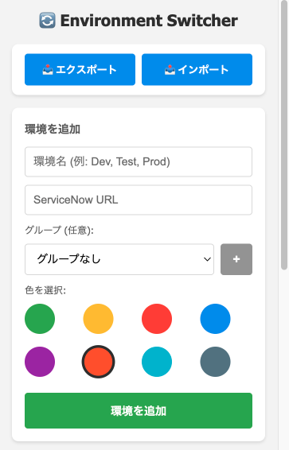
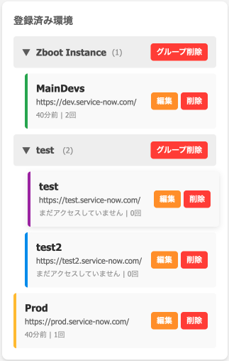
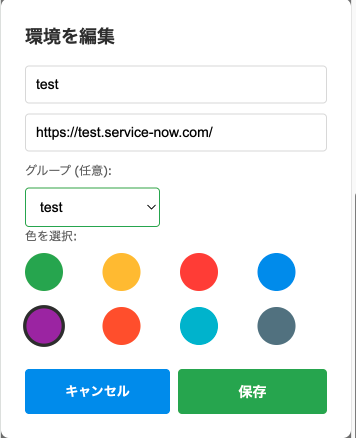

# ServiceNow Environment Switcher

ServiceNowの複数環境を簡単に切り替えるChrome拡張機能


## 🎯 主な機能

### 基本機能

- **環境登録**: Dev/Test/Prod など複数の環境を登録・管理
- **ワンクリック切り替え**: 登録済み環境に瞬時に移動
- **8色のカラーパレット**: 環境ごとに色を設定して視覚的に区別
- **環境の編集**: 登録済み環境の情報を後から編集可能

### 高度な機能

- **現在の環境を表示**: 開いている環境を自動検出して強調表示
- **動的アイコン**: タブごとにアイコンの色が環境に応じて変化
- **バッジ表示**: 拡張機能アイコンに環境名を表示
- **アクセス履歴**: 最終アクセス日時とアクセス回数を記録
- **環境のグループ化**: プロジェクトやクライアントごとに環境を整理
- **ドラッグ&ドロップ**: グループを直感的に並び替え
- **お気に入り機能**: よく使う環境をピン留めして上位表示
- **メモ機能**: 環境ごとに説明やヒントを記録
- **キーボードショートカット**: `Alt+Shift+1/2/3` で素早く切り替え
- **エクスポート/インポート**: 環境設定をJSON形式で保存・復元
- **ダークモード**: ライト/ダーク/システム設定に追従
- **同じレコード維持**: 環境切り替え時に現在のレコードを保持（設定可能）
- **タブタイトルプリフィックス**: 環境名をタブタイトルに表示（例: [MAIN]）

## 📸 スクリーンショット





### メイン画面

環境の登録、グループ化、一覧表示

### 現在の環境の表示

開いている環境が緑色で強調表示され、「現在の環境」バッジが表示されます

### アイコンの色変更

環境に応じて拡張機能のアイコンの色が動的に変わります

### 編集モーダル

環境の情報を簡単に編集できます

## 🚀 インストール方法

### 開発版として手動インストール

1. このリポジトリをクローン

```bash
git clone https://github.com/gozu52/chrome_extention_environment-switcher.git
```

2. Chromeで `chrome://extensions/` を開く

3. 右上の「デベロッパーモード」をONにする

4. 「パッケージ化されていない拡張機能を読み込む」をクリック

5. クローンした `environment-switcher` フォルダを選択

## 📖 使い方

### 1. 環境を登録

1. 拡張機能アイコンをクリック
2. 「環境を追加」セクションで：
   - **環境名**を入力（例: Dev, Test, Prod）
   - **ServiceNowのURL**を入力
   - **グループ**を選択（任意）
   - **色**を選択（8色から選択可能）
3. 「環境を追加」ボタンをクリック

### 2. グループを作成

1. 「グループ (任意)」の右にある **「+」ボタン** をクリック
2. グループ名を入力（例: 開発環境、本番環境、顧客A）
3. 環境登録時または編集時にグループを選択

### 3. 環境を切り替え

#### 方法1: クリックで切り替え

1. 拡張機能アイコンをクリック
2. 「登録済み環境」から移動したい環境をクリック
3. 自動的に該当のURLに移動

#### 方法2: キーボードショートカット

- `Alt+Shift+E` - ポップアップを開く
- `Alt+Shift+1` - 1番目の環境に切り替え
- `Alt+Shift+2` - 2番目の環境に切り替え
- `Alt+Shift+3` - 3番目の環境に切り替え

*ショートカットは `chrome://extensions/shortcuts` でカスタマイズ可能*

### 4. 環境を編集

1. 拡張機能アイコンをクリック
2. 編集したい環境の **「編集」ボタン**（オレンジ色）をクリック
3. モーダルで環境名、URL、グループ、色、メモを変更
4. **「保存」** をクリック

### 5. 環境を削除

1. 拡張機能アイコンをクリック
2. 削除したい環境の **「削除」ボタン**（赤色）をクリック
3. 確認ダイアログで「OK」をクリック

### 6. エクスポート/インポート

#### エクスポート

1. **「📥 エクスポート」** ボタンをクリック
2. JSONファイルがダウンロードされる

#### インポート

1. **「📤 インポート」** ボタンをクリック
2. 以前エクスポートしたJSONファイルを選択
3. 「追加」または「上書き」を選択

### 7. お気に入り機能

1. 環境の左側の **「☆」ボタン** をクリック
2. **「⭐」** に変わり、お気に入りに登録
3. お気に入り環境が自動的に上位に表示
4. もう一度クリックで解除

### 8. メモ機能

1. 環境の **「編集」** ボタンをクリック
2. **「メモ (任意)」** 欄に説明を入力
   - 例: `管理者権限でログイン`, `テスト用データあり`
3. 保存すると環境リストにメモが表示される

### 9. ダークモード

1. タイトル横の **「⚙️」** アイコンをクリック
2. テーマを選択：
   - 🌞 ライトモード
   - 🌙 ダークモード
   - 🔄 システム設定に従う
3. 即座にテーマが変わる

### 10. グループの並び替え

1. グループヘッダー全体を **ドラッグ**
2. 別のグループの上に **ドロップ**
3. グループの順序が変わる

### 11. 設定のカスタマイズ

1. タイトル横の **「⚙️」** アイコンをクリック
2. 以下の設定が可能:
   - **テーマ**: ライト/ダーク/システム設定
   - **同じレコードを保持**: 環境切り替え時に現在のページを維持
   - **タブタイトルに環境名を表示**: [MAIN] などのプリフィックスを追加

## 💡 推奨される使い方

### 色分けの例

- 🟢 **緑色** - Dev環境（開発）
- 🟡 **黄色** - Test環境（テスト）
- 🔴 **赤色** - Prod環境（本番・注意！）
- 🔵 **青色** - Sandbox環境（検証）
- 🟣 **紫色** - UAT環境（ユーザー受入テスト）
- 🟠 **オレンジ色** - Staging環境
- 🩵 **水色** - Demo環境
- ⚫ **グレー** - アーカイブ環境

### グループ化の例

- **プロジェクトA** - 顧客Aの開発・本番環境
- **プロジェクトB** - 顧客Bの開発・本番環境
- **社内環境** - 自社の検証・デモ環境
- **パートナー環境** - パートナー企業の環境

### 設定のおすすめ

- **同じレコードを保持**: ON推奨（レコード間の移動が楽）
- **タブタイトルプリフィックス**: ON推奨（複数タブ使用時に便利）
- **テーマ**: システム設定に従う（自動切り替え）

## 🛠 技術スタック

- **Manifest V3** - 最新のChrome拡張機能仕様
- **Vanilla JavaScript** - 軽量でシンプル
- **Chrome Storage API** - 環境設定の永続化
- **Canvas API** - 動的アイコン生成
- **Chrome Commands API** - キーボードショートカット

## 📋 開発ロードマップ

### Phase 1 - MVP ✅ 完了

- [x] 環境登録機能
- [x] 環境切り替え機能
- [x] 色分け表示
- [x] 現在の環境表示
- [x] 動的アイコン

### Phase 2 - 追加機能 ✅ 完了

- [x] アクセス履歴機能
- [x] エクスポート/インポート機能
- [x] 環境のグループ化
- [x] ショートカットキー対応
- [x] 環境の編集機能
- [x] 8色のカラーパレット
- [x] グループ名の編集
- [x] グループの並び替え

### Phase 3 - UX向上 ✅ 完了

- [x] ダークモード対応
- [x] お気に入り（ピン留め）機能
- [x] グループのドラッグ&ドロップ
- [x] 環境ごとのメモ機能

### Phase 4 - 競合差別化（開発中）

- [x] 同じレコードを維持したまま環境切り替え
- [x] 環境ごとのプリフィックス表示
- [x] 環境のコピー機能

## 🔒 プライバシー

- すべてのデータはローカル（Chrome Storage）に保存されます
- 外部サーバーへのデータ送信は一切行いません
- ServiceNowのログイン情報は保存しません

## 🤝 コントリビューション

Issue、Pull Requestは大歓迎です！

### 開発環境のセットアップ

```bash
# リポジトリをクローン
git clone https://github.com/gozu52/chrome_extention_environment-switcher.git
cd chrome_extention_environment-switcher

# chrome://extensions/ で「パッケージ化されていない拡張機能を読み込む」
# 変更を加えたら拡張機能を再読み込み
```

## 📝 ライセンス

MIT License

## 👤 作成者

[@gozu52](https://github.com/gozu52)

## 🙏 謝辞

ServiceNow開発者の皆様の環境切り替えの手間を少しでも軽減できれば幸いです。

---

## 📞 サポート

問題が発生した場合は、[Issues](https://github.com/gozu52/chrome_extention_environment-switcher/issues)を開いてください。
